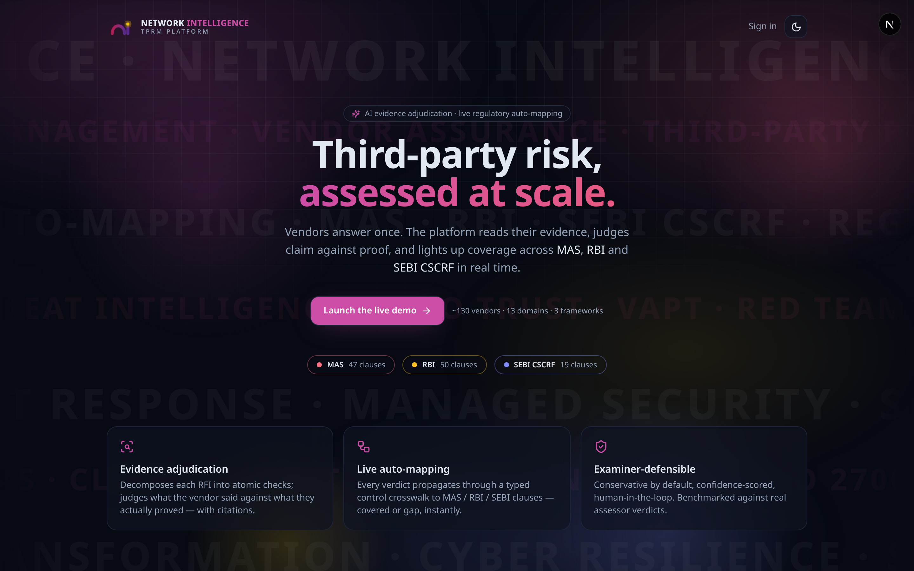
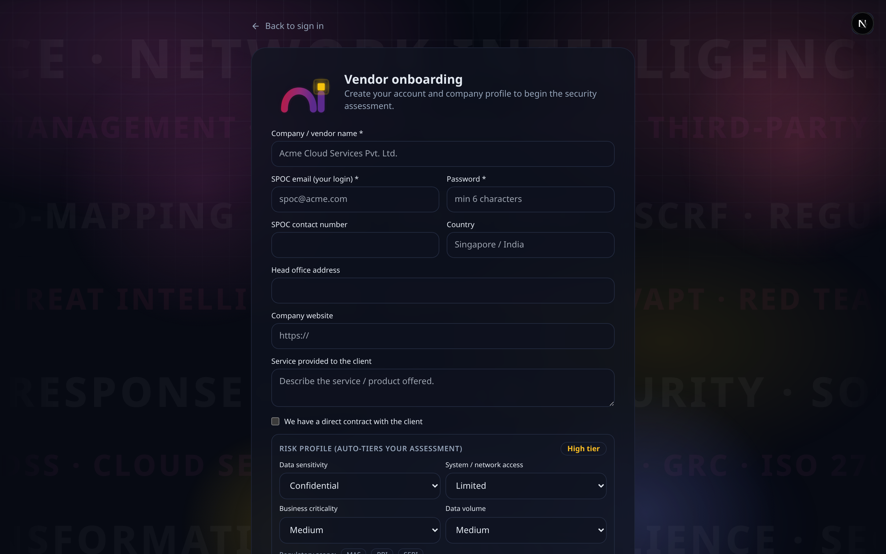
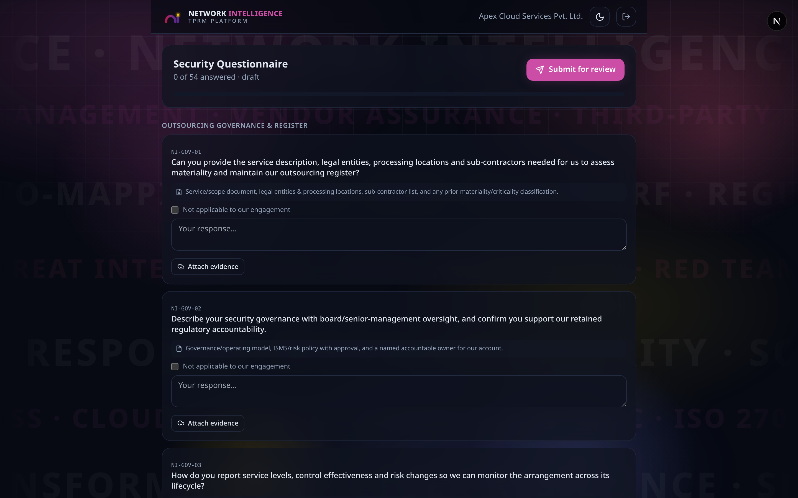
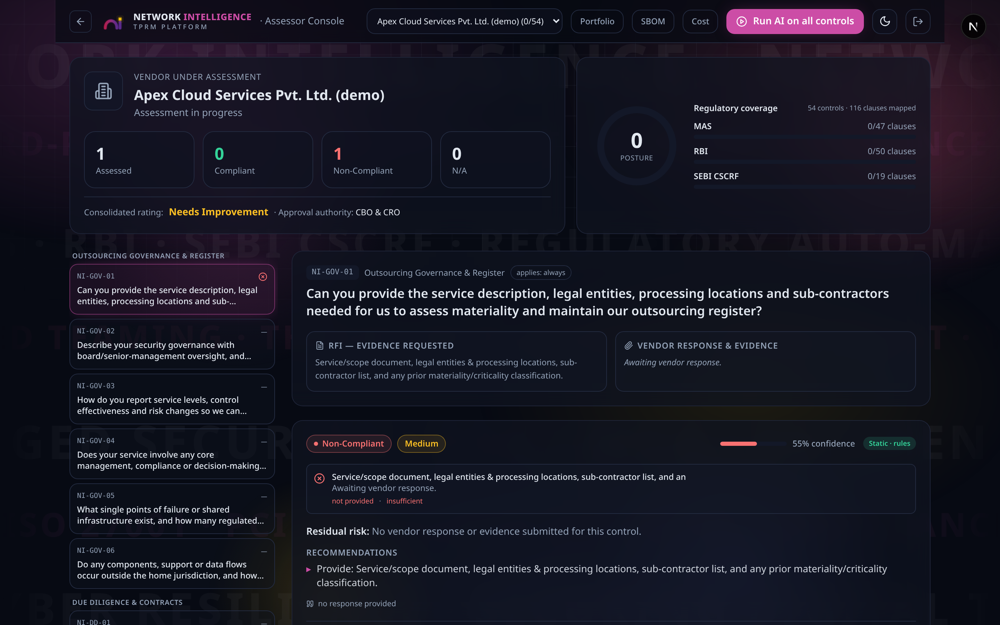
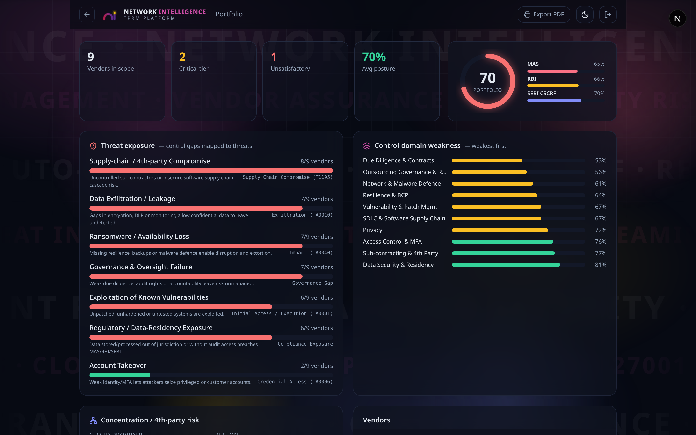
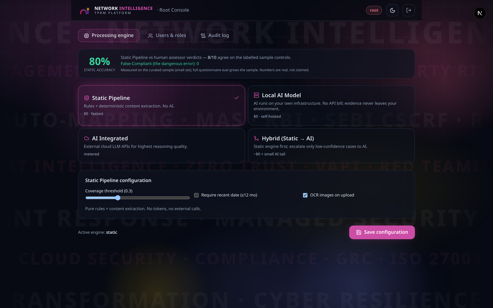
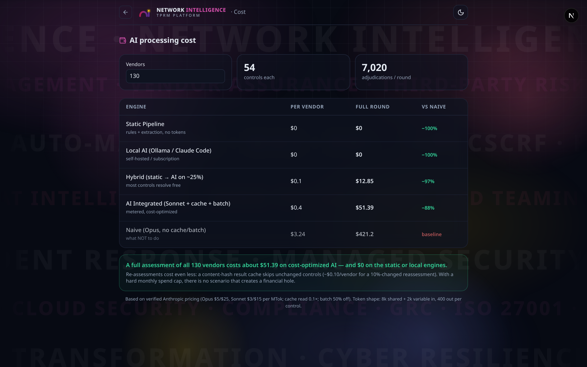
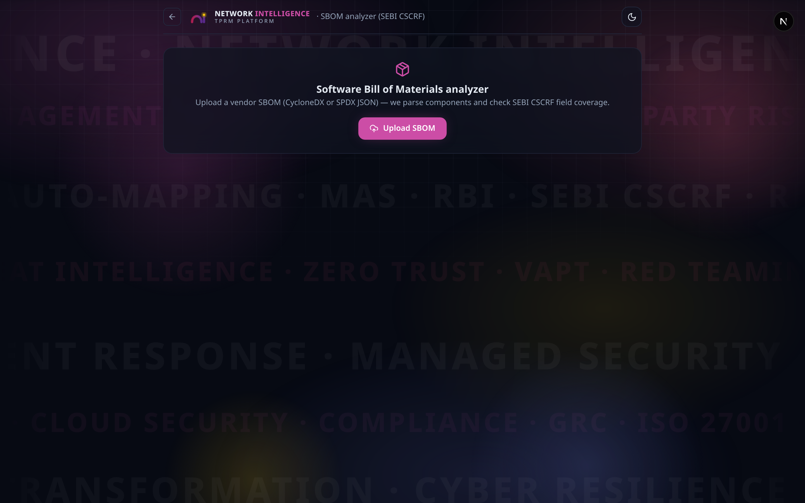
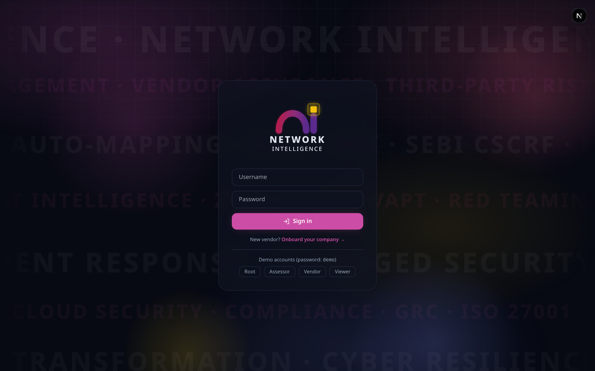

<div align="center">

# Network Intelligence — TPRM Platform

**AI-assisted Third-Party Risk Management for banks & regulated entities**

Vendors answer a security questionnaire once. The platform reads their evidence, judges the claim against the proof, and **auto-maps every verdict to MAS · RBI · SEBI CSCRF** in real time — with a configurable processing engine that runs from **$0** (rules) to full cloud AI.



</div>

---

## 🚀 Quick start (for mentors)

**Runs fully offline — no API key, no Docker, no database needed.** You only need Node.js.

### 1. Install Node.js 20+
Get it from **https://nodejs.org** (LTS). Check it: `node -v` (should print v20 or higher).

### 2. Get the code
```bash
git clone https://github.com/vish-sec/GRC_NI_TPRM.git
cd GRC_NI_TPRM/web
```
*(Or, if you received a zip: unzip it, then `cd GRC_NI_TPRM/web`.)*

### 3. Install & run
```bash
npm install      # one-time (downloads dependencies, ~1–2 min)
npm run dev      # starts the app
```

### 4. Open it
Go to **http://localhost:3000** in your browser.

### 5. Sign in (demo accounts — password is `demo` for all)
| Username | Role | Lands on |
|----------|------|----------|
| `root`   | Root Administrator | `/admin` |
| `dbs`    | Assessor (the bank) | `/console` |
| `apex`   | Vendor | `/vendor` |
| `viewer` | Audit Viewer (read-only) | `/admin` |

> **Tip:** if a page ever looks broken/unstyled, it's a cached page — hard-refresh with **Ctrl+Shift+R** (Windows/Linux) / **Cmd+Shift+R** (Mac), or open an incognito window. To **stop** the app, press `Ctrl+C` in the terminal. Local data lives in `web/.data/` (delete it to reset the demo).

---

## 🎬 Presenting in ~5 minutes

**Start with the guided deck:** open **http://localhost:3000/workflow** — an animated, slide-by-slide walkthrough of the whole TPRM lifecycle with screenshots of each feature (use ← / → arrows). It needs no login and is built exactly for this conversation.

Then do a quick live click-through:

1. **Vendor** (`apex` → `/vendor`) — the **categorized, collapsible questionnaire**; type an answer (autosaves), mark one control *Not Applicable* (it now **requires a reason**), attach evidence, **Submit**.
2. **Assessor** (`dbs` → `/console`) — pick the demo vendor, **Adjudicate** a control (verdict + risk + confidence + citations + **live MAS/RBI/SEBI mapping**), then show the two headline additions:
   - **Act on behalf of the vendor** (onsite/remote) — enter answers / upload evidence *for* them, recorded with attribution.
   - **Override the verdict** with a mandatory rationale — the human is the final authority.
3. **Compliance** (`/compliance`) — **Contracts/MSA** with a mandatory-clause checklist mapped to MAS/RBI/SEBI, the **Obligations** register, **Compliances** (cert expiry tracking), the **Custom compliance list**, and the **auto-reminders** (renewals / obligations / expiries).
4. **Portfolio** (`/portfolio`) — posture, threat exposure, framework coverage, concentration, consolidated rating + approval authority.
5. **Root** (`root` → `/admin`) — processing engine (Static / Local / AI / Hybrid), masked tokens, users & invites, audit log, and the **static-engine accuracy** number (90% on the labelled sample).

> A 2-minute version of this also lives in **[RUN_LOCALLY.md](RUN_LOCALLY.md)**.

---

## Table of contents
- [🚀 Quick start (for mentors)](#-quick-start-for-mentors)
- [🎬 Presenting in ~5 minutes](#-presenting-in-5-minutes)
- [What it does](#what-it-does)
- [Screenshots](#screenshots)
- [Key features](#key-features)
- [How it works](#how-it-works)
- [Processing engines](#processing-engines)
- [Regulatory coverage](#regulatory-coverage)
- [Architecture](#architecture)
- [Tech stack](#tech-stack)
- [Prerequisites](#prerequisites)
- [Getting started](#getting-started)
- [Environment variables](#environment-variables)
- [Roles & demo accounts](#roles--demo-accounts)
- [End-to-end flow](#end-to-end-flow)
- [API reference](#api-reference)
- [Project structure](#project-structure)
- [Cost efficiency](#cost-efficiency)
- [Regenerating screenshots](#regenerating-screenshots)
- [Production readiness & roadmap](#production-readiness--roadmap)
- [Security notes](#security-notes)

---

## What it does

Third-Party Risk Management (TPRM) at scale for a bank assessing ~120–130 vendors. The platform replaces the spreadsheet-and-email assessment cycle with:

1. **Vendor onboarding + inherent-risk tiering** — each vendor self-onboards (or is invited), captures a company profile, and is auto-tiered **Critical / High / Medium / Low**.
2. **A coverage-complete questionnaire** — **54 controls covering all 116 MAS / RBI / SEBI CSCRF clauses** (verified at build time — the build fails if any clause is orphaned).
3. **AI / static evidence adjudication** — the engine reads the vendor's statement *and* the content of uploaded evidence (PDF/DOCX/text/OCR), and decides whether the evidence actually substantiates the claim.
4. **Live regulatory auto-mapping** — each verdict propagates through a typed control→clause crosswalk and lights up MAS/RBI/SEBI coverage.
5. **Portfolio threat mapping, consolidated risk rating, remediation loop, SBOM analysis, and a cost dashboard.**

> The core insight: **the finding lives in the gap between what the vendor *says* and what the evidence *shows*.**

---

## Screenshots

| Vendor onboarding (with live tiering) | Vendor questionnaire portal |
|---|---|
|  |  |

| Assessor console (adjudication + mapping) | Portfolio — threat exposure & concentration |
|---|---|
|  |  |

| Root admin — processing engine & accuracy | Cost dashboard |
|---|---|
|  |  |

| SBOM analyzer (SEBI CSCRF) | Sign in |
|---|---|
|  |  |

---

## Key features

- **Categorized, collapsible questionnaire** — 54 unified controls grouped into expandable sections by control family (per-section progress + expand/collapse-all), each question *born mapped* to all 116 MAS/RBI/SEBI clauses with typed relationships (Equal / Subset / Superset / Intersection). Build-time coverage verification (no orphan clauses).
- **Assessor authority — override & act-on-behalf** — the assessor/DBS can **override any engine verdict** with a mandatory rationale (the human is the final authority), and **enter answers / upload evidence on behalf of a vendor** (onsite or remote), recorded with full attribution so it's never mistaken for vendor self-attestation. Marking a control *Not Applicable* **requires a reasoning statement**.
- **Contracts & Compliance workspace** (`/compliance`) — upload the **Contract/MSA** with a mandatory-clause checklist mapped to MAS/RBI/SEBI; a **company obligations & requirements** register; **compliances / certification** tracking with auto-derived expiry status; a **custom compliance list**; and **auto-reminders** for contract renewals, obligations, and cert expiries.
- **Pluggable processing engine** (Root-configurable): **Static Pipeline** ($0 rules), **Local AI Model** (Ollama / Claude Code Personal, $0), **AI Integrated** (Claude / OpenAI GPT / xAI Grok / Google Gemini), **Hybrid** (static-first, AI only on low confidence). Always falls back to static — never breaks, never wastes a token.
- **Content-aware evidence extraction** — PDF/DOCX/text + image OCR, cached by SHA-256 content hash and shared by both the static and AI engines.
- **Animated workflow deck** (`/workflow`) — a public, slide-by-slide presentation of the whole lifecycle with embedded feature screenshots.
- **Evidence viewer** — view an uploaded file's extracted text with the control's keywords highlighted.
- **Regulatory auto-mapping** — live MAS/RBI/SEBI clause coverage with an animated tracer graph.
- **Threat exposure mapping** — control gaps mapped to threats (Account Takeover, Data Exfiltration, Ransomware, Supply-chain, …) tagged with MITRE ATT&CK tactics.
- **Portfolio dashboard** — posture, per-framework compliance, control-domain weakness heatmap, cloud/region concentration (4th-party risk), per-vendor rating; export to PDF.
- **Consolidated risk rating + approval matrix** — from the risk dashboard model (Good → Unsatisfactory + required approval authority).
- **Remediation loop** — assessor sends a finding back; the vendor's control re-opens and auto-marks "resubmitted".
- **Inherent-risk tiering** at intake, driving questionnaire depth & cadence.
- **SBOM analyzer** — parse CycloneDX/SPDX → SEBI's required field coverage.
- **Accuracy eval** — Static Pipeline measured against the sample's human verdicts (real number, not a claim).
- **RBAC** — Root / Assessor / Vendor / Viewer with a permission matrix.
- **Audit log**, **cost dashboard**, **light/dark theme**, animated NI brand + kinetic-typography backdrop.

---

## How it works

The AI/static adjudication pipeline, per control:

```
Vendor submits response + evidence files
        │
        ▼
[0] Extract evidence content  ── PDF / DOCX / text / OCR, cached by SHA-256 hash
        │
        ▼
[1] Adjudicate (engine chosen by Root)
        ├── Static:    rules — applicability, response presence, evidence presence,
        │              RFI keyword coverage over CONTENT, standards (ISO/SOC2/AES…), currency
        ├── Local AI:  Ollama / Claude Code (Personal)
        ├── AI Integrated: Claude / GPT / Grok / Gemini  (prompt-cached + batchable)
        └── Hybrid:    static first; escalate to AI only when confidence < threshold
        │
        ▼
[2] Verdict + risk + confidence + evidence checks + citations
        │
        ▼
[3] Auto-map verdict → MAS / RBI / SEBI clauses (typed crosswalk)
        │
        ▼
[4] Consolidated rating + approval matrix · threat exposure · portfolio rollup
        │
        ▼
[5] Non-compliant?  → assessor sends back → vendor remediates → re-adjudicate
```

---

## Processing engines

Configured by the Root user in **Admin → Processing engine**. Each category has its own config; tokens are stored server-side and shown only as `••••last4`.

| Category | Cost | What | Config |
|---|---|---|---|
| **Static Pipeline** | $0 | Rules + content extraction, no AI | coverage threshold, require-recent-date, OCR toggle |
| **Local AI Model** | $0 | Runs on your infra; data stays local | Ollama (URL+model) or **Claude Code (Personal)** |
| **AI Integrated** | metered | Cloud LLM APIs | Claude / GPT / Grok / Gemini + token/model |
| **Hybrid** | ~$0 + small tail | Static first → AI on low-confidence only | escalate-to + confidence threshold |

The engine **always falls back to the free static pipeline** on any error, missing key, or empty model output.

---

## Regulatory coverage

Built **from the standards**, not a generic checklist mapped afterwards. Source clause catalogs live in `web/src/data/sources/{mas,rbi,sebi}.json`.

| Framework | Clauses | Examples covered |
|---|---|---|
| **MAS** | 47 | Notice 658 register/materiality, 3-yr audit, Notice 655 cyber hygiene (MFA, patching…), TRM, BCM/SRTO, cross-border |
| **RBI** | 50 | IT Outsourcing 2023 (data-in-India, 6-hr incident, sub-contracting), IT Governance Sec.10/escrow, CSF, payment-data localization, digital lending |
| **SEBI CSCRF** | 19 | GV.SC supply chain, SBOM, PR.DS keys-in-India, PR.AA MFA, VAPT cadence, ISO 27001, M-SOC |

**54 controls cover all 116 clauses with zero orphans** — enforced by `tools/build_seed.py` at build time.

> ⚠️ Clause IDs/text were compiled from regulatory research; confirm exact sub-clause numbers against the official PDFs before using as a compliance system of record.

---

## Architecture

- **Data model:** `Vendor → Submission → Answer(+Evidence) → Review`, with a separate **control library** (questionnaire template) and a **clause crosswalk**.
- **Auto-mapping:** one unified control set; each control maps to many framework clauses with **typed relationships** (NIST IR 8477 STRM style) so partial vs full coverage is explicit.
- **Persistence / storage / auth** are behind clean interfaces with local implementations now (JSON file store, local FS, signed-cookie sessions) → swap to **Postgres / S3 / IdP+MFA** in production without touching app code.
- **Cost controls:** content-hash result/extraction cache, prompt-cacheable shared context, batchable, applicability gating, model routing.

---

## Tech stack

- **Next.js 16** (App Router, standalone output) · **React 19** · **TypeScript**
- **Tailwind CSS** (light/dark design tokens) · **Framer Motion**
- **Anthropic SDK** + OpenAI-compatible / Gemini / Ollama / Claude Code backends
- Evidence extraction: **pdf-parse**, **mammoth** (DOCX), **tesseract.js** (OCR)
- **PostgreSQL + pgvector** (in `docker-compose`, for the production persistence path)
- Fully **Dockerized** — host-portable (no Vercel/Supabase lock-in)

---

## Prerequisites

- **Node.js ≥ 20** (developed on Node 22)
- **npm** (or pnpm/yarn)
- *(optional)* **Docker + Docker Compose** for the one-command full stack
- *(optional)* an **Anthropic / OpenAI / Gemini API key**, or **Ollama** running locally, for live AI (the platform is fully functional on the free **static** engine without any key)

---

## Getting started

### Local (fastest)
```bash
cd web
npm install
npm run dev        # http://localhost:3000
```
Works immediately on the **static** engine (no API key needed). Sign in with a demo account (below).

### Full stack (Docker, portable)
```bash
cp .env.example .env          # optionally add an API key
docker compose up --build     # web on :3000, postgres+pgvector on :5432
```

### Build
```bash
cd web && npm run build && npm start
```

---

## Environment variables

`.env` (all optional for the demo):

| Variable | Purpose |
|---|---|
| `ANTHROPIC_API_KEY` | Live Claude adjudication (else static fallback) |
| `ANTHROPIC_MODEL` | default `claude-sonnet-4-6` |
| `SESSION_SECRET` | HMAC secret for session cookies (set in production) |
| `DATABASE_URL` | Postgres (production persistence path) |
| `DATA_DIR` | overrides the local `.data` store location |

> AI provider tokens are normally entered by the **Root user in the admin UI** (stored server-side, masked) — the env vars are only defaults/fallbacks.

---

## Roles & demo accounts

All demo passwords are `demo`.

| Username | Role | Lands on | Can do |
|---|---|---|---|
| `root` | **Root** | `/admin` | Everything — engine config, tokens, users, invites, audit |
| `dbs` | **Assessor** | `/console` | Review all vendors, adjudicate, remediation, portfolio |
| `apex` | **Vendor** | `/vendor` | Own questionnaire + evidence only |
| `viewer` | **Viewer** | `/admin` | Read-only oversight (users, settings masked, audit) |

New vendors can self-onboard at `/onboard`, or be invited by an assessor/root.

---

## End-to-end flow

**Vendor**
1. Onboard at `/onboard` (company profile + risk profile → auto-tier) or accept an invite link.
2. Answer the questionnaire, attach evidence, **Submit for review**.
3. If a finding is returned, the control re-opens — update and it auto-resubmits.

**Assessor / Root**
1. Pick a vendor in the console; review each control's response + evidence (with the **evidence viewer**).
2. **Adjudicate** (static or AI) → verdict, risk, confidence, citations, and **live MAS/RBI/SEBI mapping**. **Override** the verdict with a rationale, or **act on behalf** of the vendor (onsite/remote) to enter answers/evidence directly.
3. Send non-compliant findings **back for remediation**.
4. Track **contracts, obligations, certifications and reminders** in the **Compliance** workspace.
5. View the **portfolio** (threat exposure, concentration), **consolidated rating + approval authority**, and **export to PDF**.
6. Root configures the **processing engine**, manages **tokens**, **invites vendors**, and reviews the **audit log**.

---

## API reference

| Method | Endpoint | Auth | Purpose |
|---|---|---|---|
| POST | `/api/login` · `/api/logout` · GET `/api/me` | — | Session auth |
| POST | `/api/onboard` | — | Self/invite vendor onboarding |
| GET/POST | `/api/invite` | assessor/root | Create / look up vendor invites |
| GET/POST/PUT | `/api/submission` | vendor (own) / assessor (read) | Answers + submit |
| POST | `/api/upload` | vendor | Evidence upload + extraction |
| GET | `/api/evidence` | assessor/root | Extracted text + keywords |
| POST | `/api/adjudicate` | assessor/root | Run the configured engine (returns an assessor override if set) |
| POST/DELETE | `/api/override` | assessor/root | Set / clear an assessor verdict override (rationale required) |
| POST | `/api/submission` (`?vendorId=&mode=onsite\|remote`) | assessor/root | Enter an answer **on behalf** of a vendor (attributed) |
| POST | `/api/review` | assessor/root | Send finding back for remediation |
| GET/POST/PATCH/DELETE | `/api/contracts` | read: all · write: assessor/root | Contracts/MSA + mandatory-clause checklist |
| GET/POST/PATCH/DELETE | `/api/obligations` | read: all · write: assessor/root | Obligations & requirements register |
| GET/POST/PATCH/DELETE | `/api/compliances` | read: all · write: assessor/root | Compliance / certification tracking |
| GET/POST/DELETE | `/api/compliance-catalog` | read: all · write: assessor/root | Custom compliance list |
| GET | `/api/reminders` | assessor/root/viewer | Due/overdue renewals, obligations, expiries |
| GET/PUT | `/api/settings` | read: root/viewer · write: root | Processing engine + tokens (masked) |
| GET | `/api/portfolio` | assessor/root/viewer | Portfolio + threat aggregation |
| GET | `/api/vendors` · `/api/users` | per role | Vendor picker / user list |
| GET | `/api/eval` | root/viewer | Static-pipeline accuracy vs ground truth |
| GET | `/api/audit` | root/assessor/viewer | Audit log |
| POST | `/api/sbom` | assessor/root | Parse CycloneDX/SPDX SBOM |

---

## Project structure

```
TPRM/
├── docker-compose.yml          # web + postgres/pgvector
├── tools/build_seed.py         # generates the questionnaire seed; verifies clause coverage
├── docs/screenshots/           # README screenshots
└── web/
    ├── Dockerfile              # standalone, portable image
    └── src/
        ├── app/
        │   ├── page.tsx        # landing
        │   ├── login/ onboard/ vendor/ console/ admin/ portfolio/ cost/ sbom/ logo/
        │   └── api/            # login, onboard, submission, upload, adjudicate, review,
        │                       # settings, portfolio, vendors, users, eval, audit, sbom, evidence
        ├── components/         # animated logo, tracer graph, background, UI primitives
        ├── data/
        │   ├── seed.ts         # 54 controls + 116 clauses + crosswalk (generated)
        │   └── sources/        # MAS / RBI / SEBI clause catalogs
        └── lib/                # auth, store, users, settings, adjudicator, extract,
                                # threats, portfolio, risk, sbom, audit
```

---

## Cost efficiency

Cost is a first-class design goal (see the in-app `/cost` dashboard). On verified Anthropic pricing, a full assessment of **130 vendors × 54 controls**:

| Engine | Full round | vs naive |
|---|---|---|
| Naive (Opus, no cache/batch) | ~$420 | baseline |
| AI Integrated (Sonnet + cache + batch) | ~$50 | −88% |
| Hybrid (static → AI on ~25%) | ~$13 | −97% |
| Static / Local | **$0** | −100% |

Plus a content-hash result cache makes **re-assessments ~$0.10/vendor**. With a hard monthly spend cap, there is no runaway-cost scenario.

---

## Regenerating screenshots

```bash
cd web
npm run dev &                 # app on :3000
node shoot.mjs                # captures docs/screenshots/*.png via headless Chrome
```
Requires Google Chrome at `/usr/bin/google-chrome-stable` (puppeteer-core drives it; no browser download).

---

## Production readiness & roadmap

The functional platform is complete and demo-ready. Production hardening (architected for, swappable behind interfaces):

- **Auth:** replace signed-cookie sessions with an IdP + **MFA**
- **Persistence:** swap the JSON file store for **PostgreSQL**
- **Evidence storage:** swap local FS for **S3 + region pinning** (India / Singapore data residency)
- **Secrets:** encrypt the token store / use a secrets manager
- **Uploads:** malware scanning
- **Ops:** rate limiting, security headers, retention, penetration test before go-live
- **Notifications:** email for invites / reminders / status changes

---

## Security notes

- Passwords are **scrypt-hashed** (no plaintext); sessions are HMAC-signed httpOnly cookies.
- API provider tokens are stored server-side and never returned to the client (masked to `••••last4`).
- The local `.data/` store, `.env`, and any uploaded evidence are **gitignored**.
- The original confidential sample spreadsheet is **not committed**.

---

<div align="center">

**Network Intelligence — TPRM Platform** · built as a demo of a production-shaped foundation.

</div>
